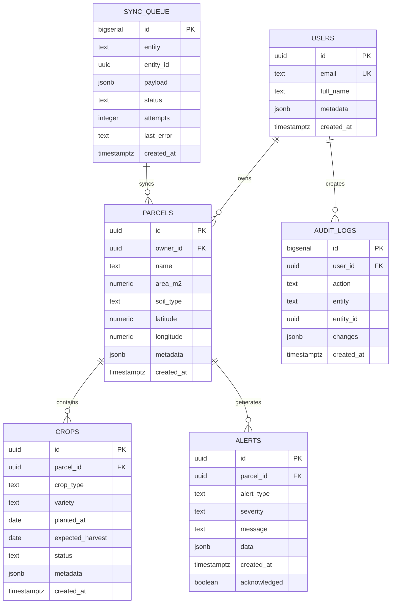

# Diagrama Entidad-Relación (ER) - AgroTech Database

## Descripción general
Base de datos Postgres en Supabase con 6 tablas principales para gestionar usuarios, parcelas, cultivos, alertas, cola de sincronización y auditoría.

---

## Diagrama ER (Mermaid)

---

## Tablas Detalladas

### 1. **USERS**
Almacena información de usuarios. Integrada con Supabase Auth (opcional).

| Campo | Tipo | Restricción | Descripción |
|-------|------|-------------|-------------|
| `id` | uuid | PK | Identificador único |
| `email` | text | UNIQUE NOT NULL | Email del usuario |
| `full_name` | text | | Nombre completo |
| `metadata` | jsonb | | Datos adicionales en JSON |
| `created_at` | timestamptz | DEFAULT now() | Fecha de creación |

---

### 2. **PARCELS**
Representa parcelas de tierra que poseen los agricultores.

| Campo | Tipo | Restricción | Descripción |
|-------|------|-------------|-------------|
| `id` | uuid | PK | Identificador único |
| `owner_id` | uuid | FK → USERS | Propietario de la parcela |
| `name` | text | NOT NULL | Nombre de la parcela |
| `area_m2` | numeric | | Área en metros cuadrados |
| `soil_type` | text | | Tipo de suelo |
| `latitude` | numeric | | Latitud (coordenadas) |
| `longitude` | numeric | | Longitud (coordenadas) |
| `metadata` | jsonb | | Datos adicionales |
| `created_at` | timestamptz | DEFAULT now() | Fecha de creación |

**Índice:** `idx_parcels_owner` (owner_id)

---

### 3. **CROPS**
Cultivos sembrados en cada parcela.

| Campo | Tipo | Restricción | Descripción |
|-------|------|-------------|-------------|
| `id` | uuid | PK | Identificador único |
| `parcel_id` | uuid | FK → PARCELS | Parcela a la que pertenece |
| `crop_type` | text | NOT NULL | Tipo de cultivo (ej: maíz, papa) |
| `variety` | text | | Variedad específica |
| `planted_at` | date | | Fecha de siembra |
| `expected_harvest` | date | | Fecha esperada de cosecha |
| `status` | text | | Estado (ej: creciendo, listo para cosechar) |
| `metadata` | jsonb | | Datos adicionales |
| `created_at` | timestamptz | DEFAULT now() | Fecha de creación |

**Índice:** `idx_crops_parcel` (parcel_id)

---

### 4. **ALERTS**
Alertas climáticas, de plagas o recomendaciones agrícolas.

| Campo | Tipo | Restricción | Descripción |
|-------|------|-------------|-------------|
| `id` | uuid | PK | Identificador único |
| `parcel_id` | uuid | FK → PARCELS (nullable) | Parcela afectada (puede ser general) |
| `alert_type` | text | NOT NULL | Tipo (ej: clima, plaga, riego) |
| `severity` | text | NOT NULL | Severidad (crítica, advertencia, info) |
| `message` | text | NOT NULL | Mensaje de alerta |
| `data` | jsonb | | Datos adicionales (ej: temperatura actual) |
| `created_at` | timestamptz | DEFAULT now() | Fecha de creación |
| `acknowledged` | boolean | DEFAULT false | ¿Ha sido reconocida? |

**Índice:** `idx_alerts_parcel` (parcel_id)

---

### 5. **SYNC_QUEUE**
Cola de sincronización para modo offline-first.

| Campo | Tipo | Restricción | Descripción |
|-------|------|-------------|-------------|
| `id` | bigserial | PK | Identificador único |
| `entity` | text | NOT NULL | Tipo de entidad (ej: parcel, crop) |
| `entity_id` | uuid | | ID de la entidad |
| `payload` | jsonb | NOT NULL | Datos a sincronizar |
| `status` | text | DEFAULT 'pending' | Estado (pending, synced, error) |
| `attempts` | integer | DEFAULT 0 | Intentos de sincronización |
| `last_error` | text | | Último error, si lo hay |
| `created_at` | timestamptz | DEFAULT now() | Fecha de creación |

**Índice:** `idx_sync_queue_status` (status)

---

### 6. **AUDIT_LOGS**
Registro de auditoría para rastrear cambios.

| Campo | Tipo | Restricción | Descripción |
|-------|------|-------------|-------------|
| `id` | bigserial | PK | Identificador único |
| `user_id` | uuid | FK → USERS (nullable) | Usuario que realizó la acción |
| `action` | text | NOT NULL | Acción (INSERT, UPDATE, DELETE) |
| `entity` | text | | Tipo de entidad modificada |
| `entity_id` | uuid | | ID de la entidad modificada |
| `changes` | jsonb | | Cambios realizados |
| `created_at` | timestamptz | DEFAULT now() | Fecha de la acción |

---

## Relaciones Principales

1. **USERS → PARCELS**: Un usuario puede tener varias parcelas (`1..N`)
2. **PARCELS → CROPS**: Una parcela puede tener varios cultivos (`1..N`)
3. **PARCELS → ALERTS**: Una parcela puede generar varias alertas (`1..N`)
4. **USERS → AUDIT_LOGS**: Un usuario realiza varias acciones de auditoría (`1..N`)
5. **SYNC_QUEUE**: Tabla independiente de cola de sincronización

---

## Clave Foránea (FK) Behavior

- **ON DELETE CASCADE**: Si se elimina un usuario o parcela, se eliminan los registros dependientes (cultivos, alertas, etc.)
- **ON DELETE SET NULL**: En caso de auditoría, si se elimina el usuario, se pone NULL en `user_id`

---

## Índices Creados

| Índice | Tabla | Columna | Propósito |
|--------|-------|---------|-----------|
| `idx_parcels_owner` | PARCELS | owner_id | Búsquedas rápidas por propietario |
| `idx_crops_parcel` | CROPS | parcel_id | Búsquedas rápidas de cultivos por parcela |
| `idx_alerts_parcel` | ALERTS | parcel_id | Búsquedas rápidas de alertas por parcela |
| `idx_sync_queue_status` | SYNC_QUEUE | status | Búsquedas rápidas por estado de sincronización |

---

## Consideraciones de Seguridad

- **Row Level Security (RLS)**: Se recomienda habilitarla en Supabase para restringir acceso a datos del usuario.
- **Service Role Key**: Nunca compartirla en el frontend; usarla solo en backend.
- **Publicable Key**: Segura en el frontend si tienes RLS configurado.

---

## Próximos pasos

1. Ejecuta la migración SQL desde el editor SQL de Supabase.
2. Configura RLS en cada tabla según tus necesidades.
3. Conecta el frontend usando la Publishable Key en las variables de entorno.
